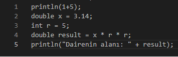
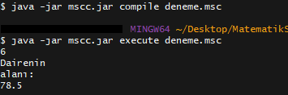

Merhaba 👋🏻 Biz yaz okulunda Programlama Dilleri dersini almış Fırat Üniversitesi öğrencileriyiz. Bu ders kapsamında gerçek sorunlara çözüm arayışında olacak ve belirlenen bir soruna yazılım ile çözüm getirmeyi amaçlayacağız.

&nbsp;

&nbsp;

# ***MatematikSorusuCozucuCore***

Projenin Amacı: Üniversite sınavına hazırlanan öğrencilere karşılaşabilecekleri soruları anlatarak çözebilen basit yazılışa sahip bir skript dili sunabilmek.

&nbsp;

&nbsp;

### Proje şuanda sadece geliştiricilere müsait

### İlerleyen zamanlarda herkesin erişimine müsait olması için çabalıyoruz 🙏🏻

[Dökümanlara göz atmak için tıklayınız](https://github.com/halefakgul/MatematikSorusuCozucuCore/tree/main/src/docs)

[Geliştirilmeye devam eden MSC arayüz ortamını görmek için tıklayınız](https://github.com/halefakgul/MatematikSorusuCozucu)

&nbsp;

&nbsp;

Örnek görüntüler:

